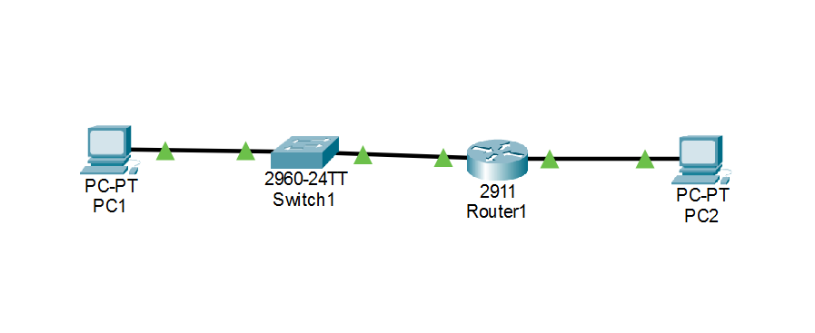

# 1 - Basic Network Connectivity

## Objective
Configure a basic network using PCs,
a switch, and a router.

## Tasks
- Configure IP addresses
- Configure default gateways
- Enable router interfaces
- Test connectivity using ping

## Troubleshooting
Corrected an incorrect default gateway
and verified successful connectivity.

## Network Topology

## IP Addressing

| Device | IP Address | Subnet Mask | Default Gateway |
|---|---|---|---|
| PC1 | 192.168.10.10 | 255.255.255.0 | 192.168.10.1 |
| PC2 | 192.168.20.10 | 255.255.255.0 | 192.168.20.1 |

## Network Verification

Connectivity between PC1 and PC2
will be tested using ICMP ping.
